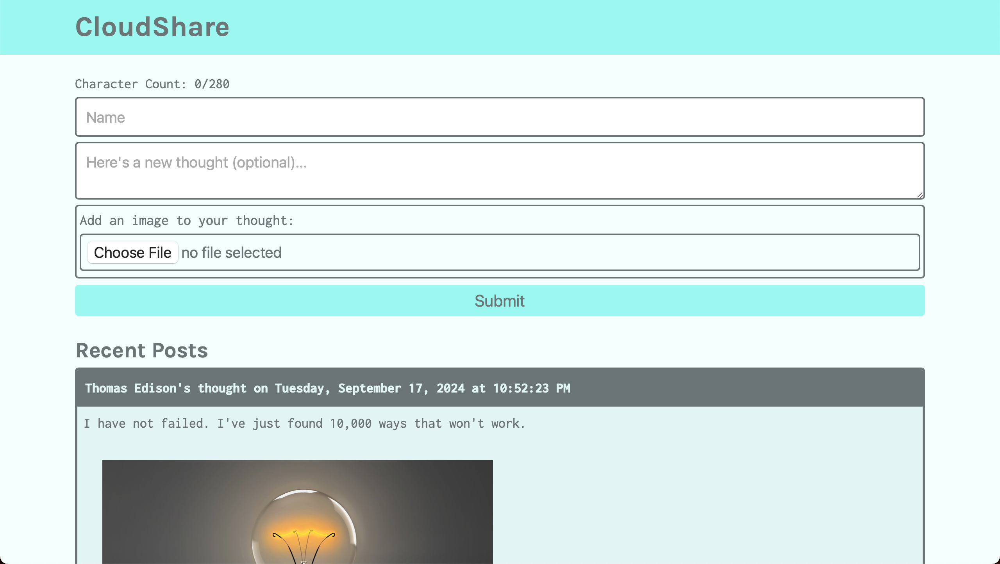
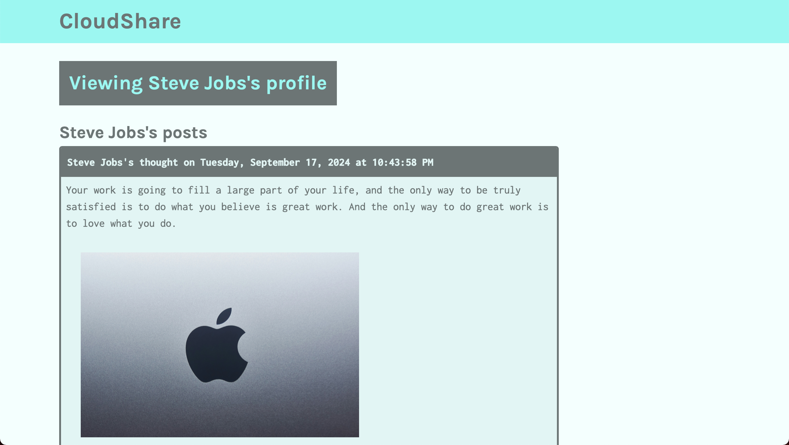

# CloudShare
*A full-stack application leveraging AWS cloud services for content sharing and image management, utilizing S3 for storage and DynamoDB for data persistence.*

## Built With
[](https://developer.mozilla.org/en-US/docs/Web/JavaScript)
[](https://react.dev/)
[](https://nodejs.org/en)
[](https://expressjs.com/)
[](https://aws.amazon.com/)
[](https://aws.amazon.com/s3/)
[](https://aws.amazon.com/dynamodb/)
[](https://aws.amazon.com/ec2/)
[](https://developer.mozilla.org/en-US/docs/Web/CSS)

## Table of Contents
- [Description](#description)
  - [Deployed Site](#deployed-site)
- [Features](#features)
- [Screenshots](#screenshots)
- [Technical Details](#technical-details)
- [Installation](#installation)
- [Usage](#usage)
- [Contributing](#contributing)
- [License](#license)
- [Questions](#questions)

## Description
CloudShare is a full-stack cloud application that demonstrates the integration of various AWS services for building scalable web applications. Built using React and Express.js, this application showcases the implementation of cloud storage, database management, and server deployment through AWS services.

The application leverages AWS S3 for image storage, DynamoDB for data persistence, and EC2 for deployment, creating a robust platform for sharing thoughts and images. Recent improvements include enhanced state management for real-time updates and a streamlined user interface for image uploads.

### Deployed Site
Note: EC2 deployment has been disabled to avoid AWS charges after free tier expiration.

## Features
* **Cloud Storage Integration**
  * S3 bucket configuration for file storage
  * Image upload handling with multer
  * File type validation
  * Public read access configuration
  * UUID-based file naming

* **Database Management**
  * DynamoDB table for thought storage
  * Username and timestamp-based queries
  * Scan operations for data retrieval
  * Real-time data updates
  * Attribute projections and expressions

* **Client-Side Routing**
  * React Router implementation
  * Profile page routing
  * Dynamic user profiles
  * 404 page handling
  * Browser history management

* **User Interface**
  * Real-time form validation
  * Image preview capabilities
  * Loading state management
  * Character count validation
  * Offline support via Service Worker

## Screenshots



## Technical Details
This cloud-based application was built using the following technologies and patterns:

* **AWS Integration**: 
  * S3 bucket and params configuration for file storage
  * DynamoDB document client setup and table schema
  * Environment variable management for AWS credentials
  * UUID implementation for unique file names
  * SDK configuration for AWS services

* **Database Architecture**:
  * DynamoDB table with username partition key
  * CreatedAt timestamp sort key
  * Scan operations for retrieving all posts
  * Query operations with key conditions
  * Expression attributes for projections

* **React Implementation**:
  * Function components with hooks (useState, useEffect)
  * React Router for client-side routing
  * Memo for performance optimization
  * Service Worker for offline capabilities
  * Dynamic route parameters with useParams

* **File Processing**:
  * Multer middleware for file uploads
  * Memory storage configuration
  * Buffer handling for file processing
  * Public read ACL setup
  * File type validation and handling

* **Express Backend**:
  * Static file serving in production
  * Route handling for users and images
  * API endpoint implementation
  * Request body parsing
  * Error handling middleware

* **State Management**:
  * Form state handling
  * Loading state tracking
  * Error message management
  * Character count validation
  * Real-time UI updates

## Installation
To run this project locally:

1. Clone the repository
   ```bash
   git clone https://github.com/kyoriku/CloudShare.git
   ```

2. Navigate to the project directory
   ```bash
   cd CloudShare
   ```

3. Install dependencies
   ```bash
   npm install
   ```

4. Configure AWS credentials
   ```bash
   aws configure
   ```
  Enter your AWS access key, secret key, and region

5. Create required AWS resources:
  * Create an S3 bucket
  * Set up a DynamoDB table
  * Configure IAM roles and policies

6. Create environment variables
   ```bash
   AWS_BUCKET_NAME=your-bucket-name
   ```

## Usage
1. Start the development server
   ```bash
   npm start
   ```

2. Use the application to:
  * Create and view posts
  * Upload images with posts
  * View user profiles
  * Manage thought content

## Contributing
Contributions are welcome! Here are ways you can help:

1. Fork the repository
2. Create a feature branch
   ```bash
   git checkout -b feature/YourFeature
   ```
3. Make your changes - this could include:
   * Adding new features
   * Improving AWS integration
   * Optimizing database queries
   * Enhancing user interface
   * Bug fixes
4. Commit your changes
5. Push to your branch
6. Open a Pull Request

Please ensure your contributions:
* Follow the existing code style
* Include appropriate error handling
* Test all changes locally
* Include clear descriptions in your pull request

## License
[](https://opensource.org/licenses/MIT)

This project is licensed under the [MIT](https://opensource.org/licenses/MIT) license - see the LICENSE file for details.

## Questions
For any questions, feel free to email me at devkyoriku@gmail.com.